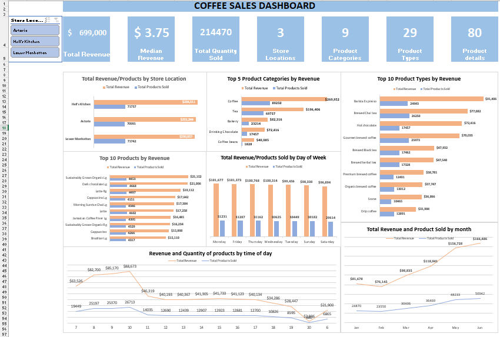

# Coffee data analysis

## Metrics and Dimensions
- **Revenue**: Total Revenue from Astoria, Hell's Kitchen and Lower Manhattan
- **Store Location**: Astoria, Hell's Kitchen and Lower Manhattan
- **Transaction Date**: Date when products were purchased
- **Transaction Time**: Time when products were purchased.
- **Product**: The category, type and details of the Product

## Insights 
1. Significantly higher revenues are recorded at Astoria(8am-10am), Hell's Kitchen (8am-10am), and Lower Manhattan (7am-10am).
2. Hell's Kitchen and Lower Manhattan recorded significantly lower revenues at closing hours. 
Hell's kitchen at (19/7pm) and Lower Manhanttan at (19{7pm) to 20(8pm).
3. Total revenue increased by 103% to $57,000 by Mid-year 2023, up from $28,000 from the beginning of the year.
4. Hell's Kitchen recorded 50% of Civet Cat Coffee which is the product with the highest unit price ($45).

## Recommendation
1. Investigate into why Astoria does not have significantly lower revenues at closing hours and implement findings to Hell's Kitchen and Lower Manhattan.
2. Records of individual customers' purchases should be provided to identify other products customers typically buy with coffee. 
